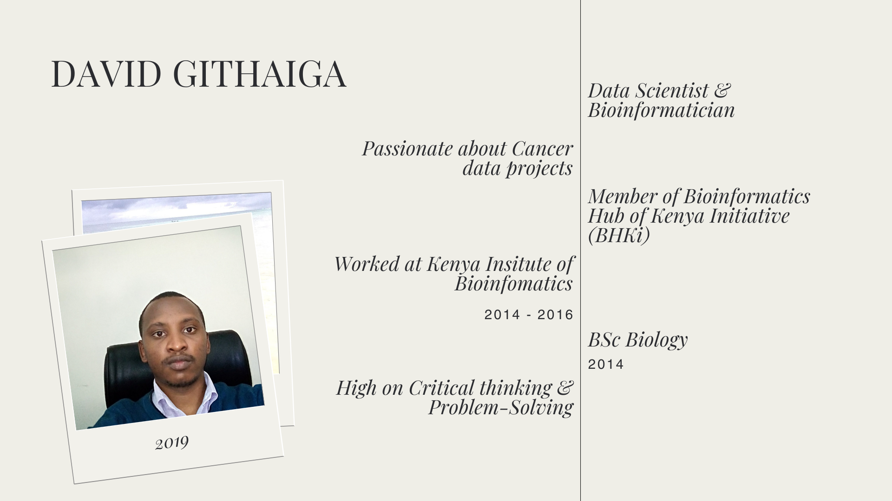

# Hi, I’m David Githaiga 👋 

# Bio
Data science with a specialization in bioinformatics is my passion. I’m a critical and analytical thinker, which makes this field particularly well-suited to me, as it requires logical problem-solving and computational skills. I have a strong affinity for both R and Python; R is a robust statistical tool, while Python is a versatile and powerful programming language.

I am particularly interested in using data science and bioinformatics to address healthcare challenges, especially in oncology.

A personal thought: While AI is a powerful tool, it can risk depersonalizing experiences, making them devoid of nuance. Therefore, it is increasingly important to infuse a human touch into today’s world, especially with the growing ubiquity of technology.

<!---
dave-mainag/dave-mainag is a ✨ special ✨ repository because its `README.md` (this file) appears on your GitHub profile.
You can click the Preview link to take a look at your changes.
--->
